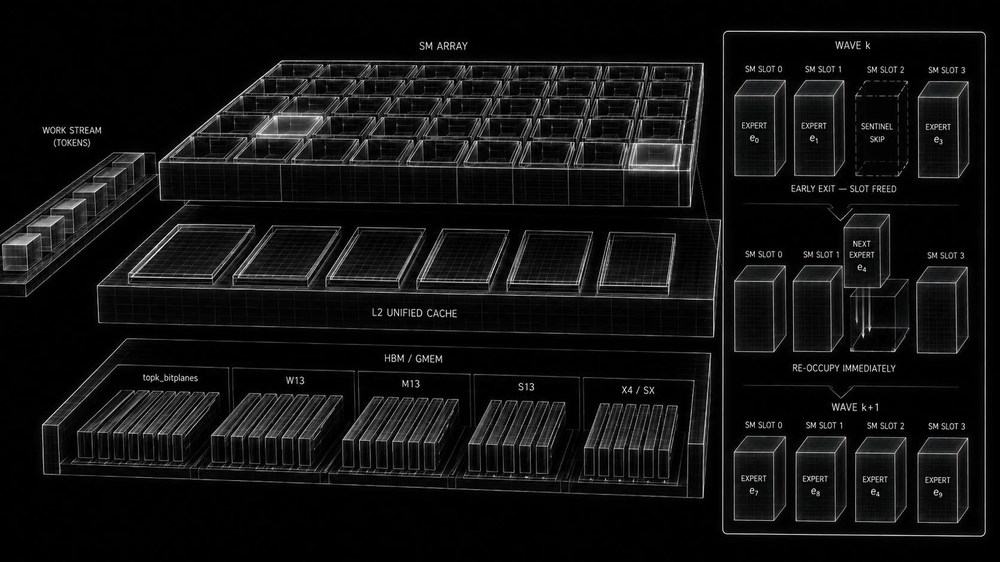

# xCaliber

This repo is the spiritual successor to "4Bit-Forge", our goal is to further assist open source efforts to democratize the inference of LLMs.

## References (To be formalized)

- PTX ISA 9.2, 9.3
- CUDA Programming Guide 13.3: CTA execution, memory transactions, coalescing, cache behavior.
- [FlashInfer GDN decode pretranspose](https://github.com/flashinfer-ai/flashinfer/blob/v0.6.7/flashinfer/gdn_kernels/gdn_decode_pretranspose.py): layout / pretranspose reference.
- [MLSys FlashLinfer Contest](https://github.com/mayankagarwals/MLSys-FlashLinfer-Contest): prefetch ideas and operand-A-in-tmem insight.
- [Colfax CUTLASS NVFP4 blockscaled GEMM tutorial](https://research.colfax-intl.com/cutlass-tutorial-nvfp4-blockscaled-gemm-on-nvidia-rtx-pro-blackwell-gpus-sm12x/): CTA=256 NVFP4/tmem reference point.
- [arXiv 2505.11594](https://arxiv.org/pdf/2505.11594): paper ref from `notes.md`.
- [arXiv 2603.07685](https://arxiv.org/pdf/2603.07685): W4A4 -> SwiGLU/topk -> W4A16 direction.

Note: The software under the same Apache 2.0 License (signed by me, Pranshu Bahadur) has been moved from IST-DASlab organization's repo to this repo.