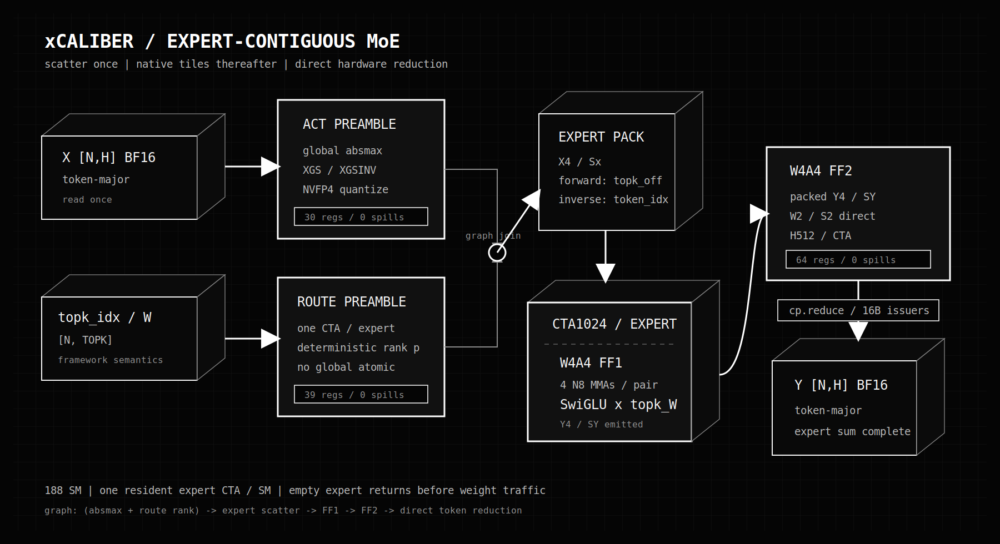
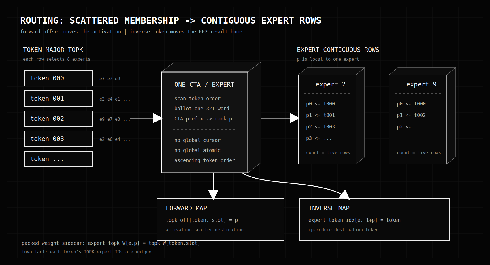
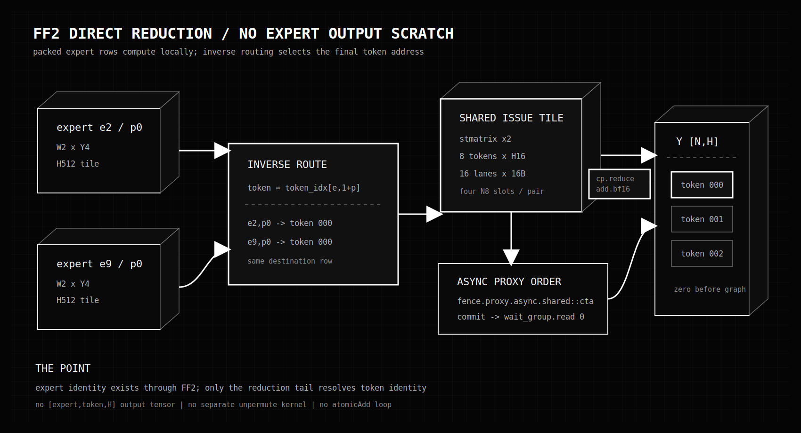
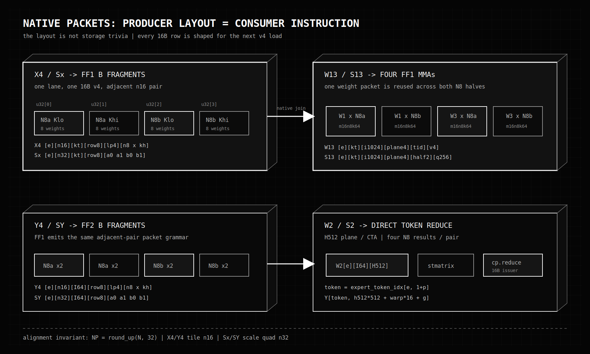

# xCaliber MoE Co-Design

Current operator board for collaborators.

```text
contract       BF16 activations in + 4-bit expert weights
hot body       native NVFP4 W4A4 FF1 + native NVFP4 W4A4 FF2
selected path  expert-contiguous compression + direct token reduction
implementation xFused-NVFP4-Kernels/xMoE/xW4A16
target         SM120+ / validated on RTX PRO 6000 Blackwell
status         63 / 63 model-routing cases PASS
```

The folder says `xW4A16` because the operator receives BF16 activations.
Compression is part of the operator. After that preamble, both GEMMs consume
NVFP4 activations directly.

## Final Call

```text
scatter once -> native tiles thereafter -> reduce straight home
```

Token-major TOPK routing is scattered by nature. The selected design pays one
deterministic scatter, then makes FF1 and FF2 operate on expert-contiguous rows.
The inverse route survives to the FF2 tail, where `cp.reduce` writes directly
into token-major `Y`.

```text
NO  sparse n16 scan inside FF1
NO  repeated BF16 activation gather per expert
NO  expert-output scratch tensor
NO  separate unpermute/reduction kernel
NO  global routing cursor or atomic rank
```



## Operator Math

For token `t`, router slot `k`, and expert `e = topk_idx[t,k]`:

```text
G[t,e] = FF1_W1_e(X[t])
U[t,e] = FF1_W3_e(X[t])
R[t,e] = topk_W[t,k] * silu(G[t,e]) * U[t,e]
P[t,e] = FF2_W2_e(R[t,e])

Y[t] = sum_k P[t, topk_idx[t,k]]
```

The implementation changes storage and scheduling, not this identity.
`topk_W` is multiplied after SwiGLU and before FF2. Expert contributions are
added in BF16 by the asynchronous FF2 reduction tail.

## The Bet

The router begins with token-major rows:

```text
token 0 -> e7, e2, e9, ...
token 1 -> e2, e4, e1, ...
token 2 -> e9, e7, e3, ...
```

Running an expert CTA directly over that space means sparse n16 occupancy.
Every live fragment can replay the same W13/S13 or W2/S2 panel for only a few
tokens. The physical problem is not merely an uncoalesced activation load; it
is weight reuse being held hostage by routing holes.

The preamble instead assigns each selected token a dense expert-local row `p`:

```text
expert 2 -> p0:t0, p1:t1, p2:t3, ...
expert 9 -> p0:t0, p1:t2, ...
```

Now one weight packet can serve four adjacent N8 consumers. Routing sparsity
becomes a short packed count, not a hole pattern inside the MMA loop.

For one token/K64 packet:

```text
BF16 source                  128B
NVFP4 X4 + UE4M3 Sx           36B
TOPK=8 packed copies          288B
```

Counting the one BF16 read, routed writes, and later expert reads gives a rough
`128 + 288 + 288 = 704B`, before sidecars and cache effects, versus `1024B` for
eight independent BF16 expert reads. The larger win is that the 36B copies are
laid out for full native tiles, so weight panels stop replaying over holes.

## Graph

```text
ACT child graph                       ROUTE child graph
X -> global absmax                    topk_idx + topk_W
  -> XGS / XGSINV                       -> packed rank p
          |                                      |
          +--------------- join -----------------+
                                  |
                                  v
                    expert-contiguous X4 / Sx scatter
                                  |
                                  v
                    FF1 -> SwiGLU -> topk_W -> Y4/SY
                                  |
                    Y zero -------+------> FF2
                                             |
                                             v
                                    cp.reduce -> Y[N,H]
```

The ACT and ROUTE child graphs are independent. Quantization/scatter begins
after both finish because it needs the global activation scale and the forward
route offset. `Y` zeroing can overlap the scatter/FF1 branch; FF2 depends on
both FF1 and the zero node.

One captured graph is timed end to end. Component timings are not added to
manufacture an operator number.

## Route Preamble



One 256-thread CTA owns one expert and scans tokens in ascending order. A warp
ballot finds hits, CTA-local prefix counts assign `p`, and only that CTA writes
the expert's sidecars.

```text
e = topk_idx[t,k]
p = rank of t among tokens routed to e

topk_off[t,k]              = p
expert_topk_W[e,p]         = topk_W[t,k]
expert_token_idx[e,0]      = count[e]
expert_token_idx[e,1 + p]  = t
```

`topk_off` is the forward map used by activation scatter.
`expert_token_idx` is the inverse map used by FF2 reduction.
`expert_topk_W` removes router-slot recovery from FF1.

There is no global packed cursor and no global atomic. The contract requires a
token's TOPK expert IDs to be unique; duplicate expert IDs in one token row are
not represented as two packed rows.

## Activation Preamble

One scale domain covers the input tensor `X[N,H]`:

```text
X_absmax = max(abs(X[t,h]))
XGS      = 2688 / X_absmax
XGSINV   = X_absmax / 2688
2688     = E2M1_MAX(6) * UE4M3_MAX(448)
```

For each original token/K64:

```text
read BF16 once
find four K16 absmax values
encode four UE4M3 block scales
encode 64 values as E2M1
scatter the same 32B X4 + 4B Sx packet to each selected expert row p
```

The global scale is computed once. The four K16 scales preserve local dynamic
range. This is the only token duplication point in the selected design.

## Expert Schedule

```text
grid             E blocks
blockIdx.x       expert e
CTA              1024 threads / 32 warps
launch bounds    one CTA / SM
empty expert     count == 0 -> return before weights
```

On the validated 188-SM GPU, 384 experts occupy at most three hardware
scheduling waves. CUDA schedules queued expert CTAs as resident CTAs finish;
there is no software RR fabric and no SMID ownership assumption.

Packed count drives both kernels:

```text
for adjacent n16 pair
  consume up to 32 packed expert rows
  mask only the final tail
```

## FF1

```text
X4 / Sx      expert-contiguous, FF1-native packets
W13 / S13    fused W1 + W3 checkpoint layout
MMA          m16n8k64 block-scaled NVFP4
body         W1 + W3 -> SwiGLU -> topk_W
output       expert-contiguous Y4 / SY + YGSINV[e]
```

Each CTA traverses `I` in I1024 groups. One I256 plane fuses matching W1 and
W3 I8 rows into the MMA M16 dimension. Four planes cover I1024.

Within one K64 step:

```text
one X4 v4 lane load  -> both N8 activation fragments
one Sx v4 scale load -> four N8 scale fragments across adjacent n16 rows
one W13/S13 fragment -> up to four m16n8k64 MMAs
```

W13 E2M1 sign bits are flipped by the checkpoint converter. FF1 does no runtime
sign transform. The two signs cancel in the SwiGLU elementwise product.

After the H reduction, FF1 applies the W1/W3 global factors, approximate SiLU,
and packed `topk_W`. It then computes an expert-global Y scale and emits Y4/SY
in the exact packet grammar FF2 expects.

No explicit activation prefetch remains in this FF1 path. The earlier L2
absorption result is still valid for scattered streaming; this selected path
removes that scattered hot loop by changing the layout first.

## FF2

```text
Y4 / SY      expert-contiguous packed FF1 output
W2 / S2      down-projection checkpoint layout
MMA          m16n8k64 block-scaled NVFP4
CTA tile     H512
tail         stmatrix -> shared issue slots -> cp.reduce
```

The FF2 CTA walks I in K64 slabs and accumulates one K2048 panel at a time.
Adjacent packed n16 rows again produce up to four N8 MMAs per W2/S2 packet.

The result never becomes an `[expert, token, H]` tensor. `stmatrix` arranges
four N8 results into shared issue tiles. The inverse sidecar resolves each
expert-local `p` back to its original token only at the reduction tail.



For one warp and one N8 result:

```text
16 issuer lanes x 16B = 256B
8 token rows x H16 x BF16 = 256B

lane 0..7    token row 0..7, H[0..7]
lane 8..15   token row 0..7, H[8..15]
```

The ordering contract is:

```text
stmatrix.sync ... shared::cta
fence.proxy.async.shared::cta
cp.reduce.async.bulk.global.shared::cta...add.noftz.bf16
cp.async.bulk.commit_group
cp.async.bulk.wait_group.read 0
```

`Y` must be zero before these additions. Direct means the inverse map computes
the final token address; it does not mean the hardware reduction disappeared.

## Why It Won

The fixed-seed Kimi comparison is end to end against the previous W4A4 path:

```text
route      direct ms   previous ms   speedup
uniform      7.0397       24.2777      3.449x
zipf        17.8848       27.3260      1.528x
burst        9.8565       21.1412      2.145x
```

Uniform improves most because work is spread across expert CTAs and almost
every packed pair is full. Zipf still has a hot-expert tail: in the N512 Kimi
sweep one expert receives 445 rows, so the last hardware wave is imbalanced.
Packing removes holes; it cannot remove real router skew.

Proof board:

```text
models             7
N                   8 / 256 / 512
routing             uniform / zipf / burst
cases               63 / 63 PASS
FF1                 56 regs / 0 spills
FF2                 64 regs / 0 spills
route mismatches    0
padded writes       0
nonfinite outputs   0
```

The emitted BF16 tensor was also compared with the previous W4A4 path:

```text
route      bit exact   mean abs delta   max rel delta
uniform      76.45%       0.01306          1.57%
zipf         89.88%       0.00740          1.42%
burst        71.72%       0.01685          1.72%
```

These are output deltas between two quantized/asynchronous-reduction paths,
not errors against a full-precision oracle.

## Trade

We buy native consumer tiles with preamble work and storage:

```text
PAY
  duplicate compressed X4/Sx across TOPK experts
  store forward + inverse route sidecars
  reserve fixed [E,NP,...] packed buffers

GET
  deterministic contiguous n16 tiles
  no sparse route scan in either GEMM
  stronger W13/W2 packet reuse
  no expert-output scratch or unpermute kernel
  framework token order restored by cp.reduce
```

This is not free compaction. It is the measured better place to pay.

## Collaborator Contract

Preserve these unless the board is deliberately reopened:

```text
NP                   round_up(N, 32)
reason               X4/Y4 tile n16; Sx/SY scale quad n32
N                    0 < N <= 65535
TOPK                 1..8 and E >= TOPK
I, H                 multiples of 64
route row            unique expert IDs per token
expert order         ascending original token order
expert header        expert_token_idx[e,0] = count
FF1 input            W13 signs already flipped
FF2 destination      expert_token_idx[e,1+p]
Y initialization     zero before FF2 cp.reduce
hardware             SM120+
```

Do not silently swap a token-major checkpoint into these kernels. The physical
layouts below are part of the instruction schedule.

## Appendix A: Symbols

```text
N       original token count
NP      round_up(N,32), packed capacity per expert
E       expert count
TOPK    selected experts per token
H       model hidden width
I       expert intermediate width
kt      H/K64 index in FF1
ktI     I/K64 index in FF2
n8      packed token group of 8
n16     packed token group of 16
n32     packed token scale group of 32
p       expert-local packed token row
q8      one 8-value E2M1 packet inside K64
lp      lane position q8 & 3
kh      K0/K32 half, q8 >> 2
g       lane >> 2 inside one warp
```

All address equations below are in `u32` units unless stated otherwise.

## Appendix B: Native Packet Map



The common rule is simple: the producer writes the register grouping the next
kernel wants to load. No generic transpose is inserted between stages.

## Appendix C: Routing Layouts

```text
topk_idx       [N,TOPK] i32
topk_W         [N,TOPK] bf16
topk_off       [N,TOPK] u16
expert_topk_W  [E,NP]   bf16
expert_token_idx[e,0]      count as u16
expert_token_idx[e,1+p]    original token as u16
```

Forward/inverse identity:

```text
e = topk_idx[t,k]
p = topk_off[t,k]

expert_topk_W[e,p]        = topk_W[t,k]
expert_token_idx[e,1+p]   = t
```

## Appendix D: X4 / Sx

Logical X4 packet:

```text
X4[e][n16][kt][row8][lp4][n8 x kh]

lane lp v4 = {
  N8a K[8*lp + 0..7],
  N8a K[32 + 8*lp + 0..7],
  N8b K[8*lp + 0..7],
  N8b K[32 + 8*lp + 0..7]
}
```

Address:

```text
X4 = e * NP * (H >> 3)
   + (p >> 4) * (H << 1)
   + kt * 128
   + (p & 7) * 16
   + (q8 & 3) * 4
   + ((p >> 3) & 1) * 2
   + (q8 >> 2)
```

Logical Sx packet:

```text
Sx[e][n32][kt][row8][a0 a1 b0 b1]

v4 = {
  n16a N8lo scale,
  n16a N8hi scale,
  n16b N8lo scale,
  n16b N8hi scale
}
```

Address:

```text
Sx = e * NP * (H >> 6)
   + (p >> 5) * ((H >> 6) << 5)
   + kt * 32
   + (p & 7) * 4
   + ((p >> 3) & 3)
```

`X4` is naturally n16. `Sx` groups two adjacent n16 rows into one n32 scale
quad. That is why `NP` must be rounded to 32, even when `N < 32`.

## Appendix E: W13 / S13

```text
W13[e][kt][i1024][plane4][thread1024][v4]
```

One u32 contains eight 4-bit weights. One thread loads a v4, or 32 weights.
One plane is `1024 threads * 16B = 16KB`.

```text
M16 rows 0..7    W1 for one I8 slice
M16 rows 8..15   W3 for the matching I8 slice
32 warps          32 x I8 = I256 per plane
4 planes          I1024
```

Address:

```text
W13 = e * (H >> 6) * (I << 4)
    + kt * (I << 4)
    + i1024 * (1 << 14)
    + plane * (1 << 12)
    + threadIdx.x * 4
```

Scales:

```text
S13[e][kt][i1024][plane4][half2][q256][pad512]

half 0   W1 scale row g
half 1   W3 scale row g+8
```

Address:

```text
S13 = e * (H >> 6) * (I << 2)
    + kt * (I << 2)
    + i1024 * (1 << 12)
    + plane * (1 << 10)
    + (threadIdx.x & 3) * (1 << 8)
    + (threadIdx.x >> 2)
```

Only `(threadIdx.x & 3) < 2` loads a scale word.

## Appendix F: Y4 / SY

Y4 mirrors X4 with the reduction axis changed from `H64` to `I64`:

```text
Y4[e][n16][ktI][row8][lp4][n8 x kh]

Y4 = e * NP * (I >> 3)
    + (p >> 4) * (I << 1)
    + ktI * 128
    + (p & 7) * 16
    + lp * 4
    + ((p >> 3) & 1) * 2
    + kh
```

SY mirrors Sx:

```text
SY[e][n32][ktI][row8][a0 a1 b0 b1]

SY = e * NP * (I >> 6)
   + (p >> 5) * ((I >> 6) << 5)
   + ktI * 32
   + (p & 7) * 4
   + ((p >> 3) & 3)
```

FF1 first tracks BF16 absmax values, reduces one expert-global maximum into
`YGSINV[e]`, then encodes the final UE4M3 `SY` words.

## Appendix G: W2 / S2

```text
W2[e][ktI][h512][thread1024][v4]

W2 = e * (I >> 6) * (H << 3)
   + ktI * (H << 3)
   + h512 * (1 << 12)
   + threadIdx.x * 4
```

```text
S2[e][ktI][h512][half2][q256]

S2 = e * (I >> 6) * (H << 1)
   + ktI * (H << 1)
   + h512 * (1 << 10)
   + (threadIdx.x & 3) * (1 << 8)
   + (threadIdx.x >> 2)
```

W2/MMA row ownership:

```text
warp = threadIdx.x >> 5
g    = (threadIdx.x & 31) >> 2
h    = h512 * 512 + warp * 16 + g
```

The second MMA row owned by each lane is `h + 8`; `stmatrix` converts those
register fragments into the 16B contiguous issue rows used by `cp.reduce`.

Reduction issuer ownership:

```text
lane < 16
token = expert_token_idx[e, 1 + p + (lane & 7)]
hbase = h512 * 512 + warp * 16 + (lane & 8)
issue = Y[token, hbase..hbase+7]    16B
```

## Appendix H: Evidence

```text
xFused-NVFP4-Kernels/xMoE/xW4A16/
  preamble.cuh
  xR57F1_contiguous_graph.cu
  xR57F2_direct_reduce_graph.cu
  benchmark.cu
  README.md
  results_models.csv
  results_models_summary.csv
  results_output_delta_vs_previous_w4a4.csv
```

`README.md` is the short result board. This document is the collaborator model.
The CUDA files remain the source of truth for live instruction ordering.
