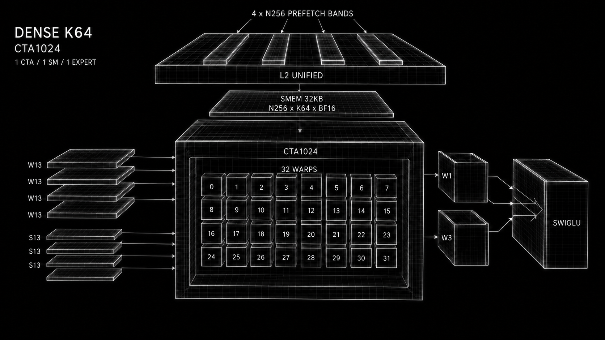
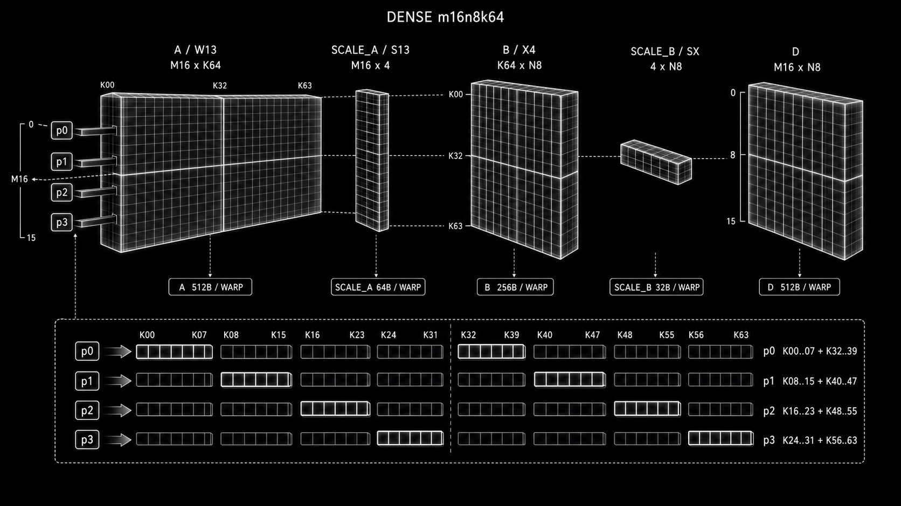
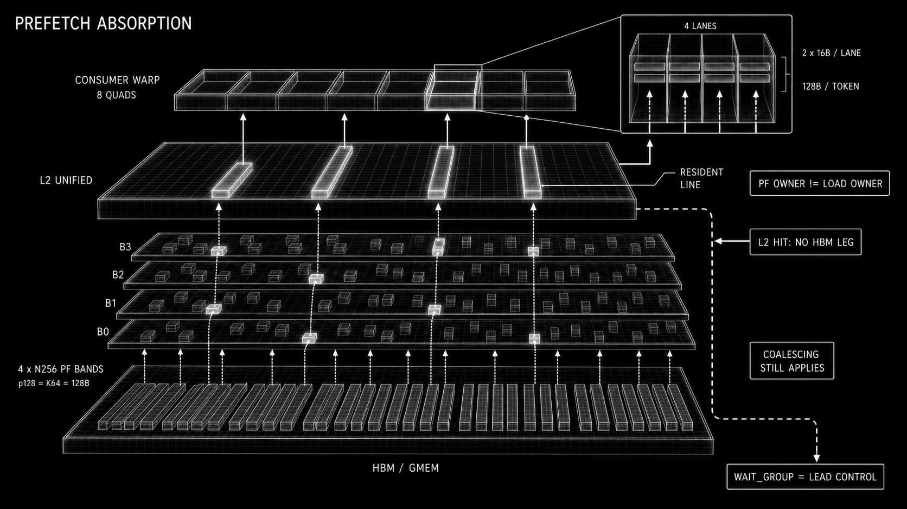
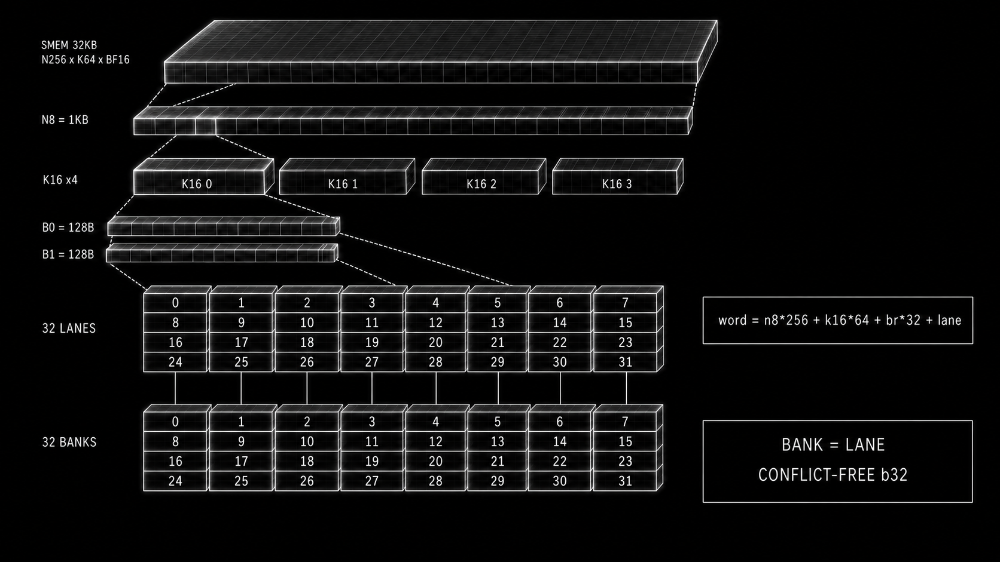
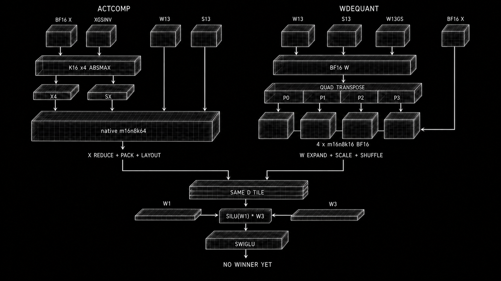

# xCaliber dense FF1 notes (by the homie Sol)
---

Team entry point: [`co-design.md`](co-design.md). This file is the deep board
for fragment math, physical layouts, bank maps, experiments, and lineage.



Visuals orient. ASCII + PTX maps remain the contract.

## Active board

### Lock now

- [ ] W13 plane -> `{W1/W3, I tile, padding/replication}` map.
- [ ] S13 plane -> W13 plane map; confirm p0/p1 row vectors + wire p1 half.
- [ ] Add `kt` + issue-bundle offsets to W13/S13 bases.
- [ ] Lock Xb header stride, n32 tail, and live-bit extraction.
- [ ] Lock the four 256T activation-prefetch bands to four K64 stripes/panels.
- [ ] Choose first complete consumer: `ACTCOMP` or `WDEQUANT`.
- [ ] Both paths must produce the same dense FF1 output tile before comparison.

### Consumer

- [ ] Lock MMAs / warp / issue: native K64 vs four BF16 K16 steps.
- [ ] Lock warp `(M16,N8)` ownership/rotation across one n256.
- [ ] Lock W1/W3 -> SwiGLU register/shuffle map.
- [ ] Wire `W13GS[0/1]`, `XGSINV`, `topk_W`, and `Y[I,N]` ownership.
- [ ] Reserve `rmem[48]` after the consumer schedule is fixed.
- [ ] Keep SMEM/mbar out of the hot path unless a real reuse/layout win exists.

### Proof

- [ ] Numerical micro-tile: one expert x one K64 x one I tile x N8.
- [ ] H/I/N tails + empty expert.
- [ ] ptxas regs/spills, L2 hit sectors, DRAM sectors, total ms.
- [ ] 1SM/expert first; 2SM W1/W3 split stays parked.

## Checkpoint

```text
LIVE = kernel.cu

dense K64 FF1
W13 + S13 + W13GS
CTA1024 = 1 CTA / SM / cluster / expert
blockIdx.x = expert e
no RR
no M13

ACTCOMP   open
WDEQUANT  open
consumer  not implemented
```

Authority:

```text
kernel.cu                    live implementation board
.vscode/notes.md             notation / reasoning style + explicit lineage
.vscode/ptx_isa_9.3.pdf      fragment / scale-selector contract
experiments/*.csv            measured memory behavior
```

Do not import the old sparse H128/RR packet board into this path.

Read tags:

```text
LOCK     kernel / PTX / CSV says it
DERIVED  byte or fragment math says it
OPEN     semantic ownership still needs a decision
```

## Macro

```text
router/topk
  |
  +-> Xb[e][0] == 0 -> CTA-local pre-emption
  |
  +-> live expert e -> CTA1024
                        |
                        +-> dense W13/S13 direct stream
                        +-> routed BF16 X p128 L2 warm
                        |
                        +-> ACTCOMP or WDEQUANT
                        +-> dense FF1
                        +-> SwiGLU
                        +-> topk_W
                        +-> Y / reduction
```

RTX PRO 6000 Blackwell Server Edition:

```text
188 SM
384 expert CTAs
ceil(384 / 188) = 3 waves

wave0  e000..187
wave1  e188..375
wave2  e376..383

empty e returns before the body -> SM takes next expert CTA
```

## CTA1024 map

Definitions:

```text
t = threadIdx.x           0..1023
w = t >> 5                0..31
l = t & 31                0..31

c = t >> 7                0..7       128T cohort
u = t & 127               0..127     thread in cohort

b = t >> 8                0..3       256T activation band
q = t & 255               0..255     token-bit index in n256
```

Horizontal:

```text
cohort   tids          warps     band   W/bundle   S/live*   p128 if all live
------   -----------   -------   ----   --------   -------   ----------------
c0       000..127      w00..03   b0       8KB        512B         16KB
c1       128..255      w04..07   b0       8KB        512B         16KB
c2       256..383      w08..11   b1       8KB        512B         16KB
c3       384..511      w12..15   b1       8KB        512B         16KB
c4       512..639      w16..19   b2       8KB        512B         16KB
c5       640..767      w20..23   b2       8KB        512B         16KB
c6       768..895      w24..27   b3       8KB        512B         16KB
c7       896..1023     w28..31   b3       8KB        512B         16KB
------   -----------   -------   ----   --------   -------   ----------------
CTA                                         64KB         4KB        128KB

* current p0 contributor half only; complete S payload = 8KB
```

Current issue is all-thread/direct. Cohorts are the spatial readback and a
future cadence handle; they are not an RR fabric.

## Dense K64 native PTX lock

Source:

```text
PTX ISA 9.3
9.7.15.5.11  Matrix Fragments for mma.m16n8k64
9.7.15.3     Block Scaling for mma.sync
Figures 43..45, 93..96
```

Target operand direction:

```text
A = W13 dense weights       M16 x K64
B = X4 / activation         K64 x N8
C/D                         M16 x N8
```

This is the ACTCOMP native-MMA contract. WDEQUANT cannot feed BF16 operands to
this opcode; it decomposes K64 into four BF16 `m16n8k16` MMAs below.

Bytes / warp / one MMA:

```text
A W13      16*64*4b = 512B     = 4 b32/thread = 1 b128/thread
B X4        64*8*4b = 256B     = 2 b32/thread
SF_A UE4M3  16*4*8b =  64B     = M16 x 4 K16 scales
SF_B UE4M3   4*8*8b =  32B     = 4 K16 scales x N8
C/D f32      16*8*4B = 512B    = 4 f32/thread
```

One b32 E2M1 packet = 8 dense K positions.
It does not represent 16 sparse source positions.



### Warp fragment map

```text
g = l >> 2       quad/group 0..7
p = l & 3        thread in quad 0..3
j = element in one b32 packet 0..7
```

A / W13:

```text
reg   matrix row   K positions
---   ----------   ----------------
a0    g            8p+0  .. 8p+7
a1    g+8          8p+0  .. 8p+7
a2    g            32+8p .. 39+8p
a3    g+8          32+8p .. 39+8p

one lane b128 = {a0,a1,a2,a3}
one warp      = full M16 x K64 A fragment
```

B / X4:

```text
reg   K positions          matrix col
---   ------------------   ----------
b0    8p+0  .. 8p+7       g
b1    32+8p .. 39+8p      g

one warp = full K64 x N8 B fragment
```

C/D:

```text
reg   row    col
---   -----  -----
d0    g      2p
d1    g      2p+1
d2    g+8    2p
d3    g+8    2p+1
```

Lane picture:

```text
quad g0 = lanes 00..03 -> A rows 00,08 | B col 0 | D rows 00,08
quad g1 = lanes 04..07 -> A rows 01,09 | B col 1 | D rows 01,09
...
quad g7 = lanes 28..31 -> A rows 07,15 | B col 7 | D rows 07,15

inside each quad:
p0 -> K00..07 + K32..39 | D cols 0,1
p1 -> K08..15 + K40..47 | D cols 2,3
p2 -> K16..23 + K48..55 | D cols 4,5
p3 -> K24..31 + K56..63 | D cols 6,7
```

### Natural CTA MMA map

DERIVED from the current thread-linear W placement:

```text
wp = W plane 0..3
h  = A row half 0..1

Mlocal(w,g,h) = 16*w + g + 8*h

one wp / warp = M16 x K64
one wp / CTA  = 32 x M16 = M512 x K64
four wp / CTA = 4 x M512 source fragments
```

Natural weight-stationary consumer:

```text
n8 = 0..31 inside one n256
token(g) = (n256<<8) + (n8<<3) + g

all warps consume the same N8 activation tile:

             token n8*8 .. n8*8+7
                      |
     +----------------+----------------+
     |                |                |
   w00              w01              w31
 M000..015        M016..031        M496..511      per wp

one n8 step / wp = M512 x N8
32 n8 steps / wp = M512 x N256
four wp           = 4 x M512 x N256
```

For output register `d`:

```text
M = Mbase(wp) + 16*w + g + 8*(d>>1)
N = (n256<<8) + (n8<<3) + 2*p + (d&1)
```

OPEN: `Mbase(wp)` is the W1/W3 + I-tile plane decision. The fragment geometry
is locked; the semantic plane labels are not.

Prefetch ownership is separate from MMA ownership. One thread can hint a
future token panel that a different warp/lane later consumes.

### W1 / W3 / output alignment

Natural four-plane candidate:

```text
wp0  W1  Mbase+000..511
wp1  W3  Mbase+000..511
wp2  W1  Mbase+512..1023
wp3  W3  Mbase+512..1023
```

Then paired W1/W3 accumulators have identical lane coordinates:

```text
D1[wp0].d0 <-> D3[wp1].d0
D1[wp0].d1 <-> D3[wp1].d1
D1[wp0].d2 <-> D3[wp1].d2
D1[wp0].d3 <-> D3[wp1].d3

same for wp2 <-> wp3

SwiGLU = silu(D1) * D3
```

No post-MMA lane transpose is needed for that pairing. OPEN before lock:

```text
confirm wp order from checkpoint writer
confirm issue-bundle Mbase stride
map expert e -> topk slot for topk_W[token,slot]
lock Y[I,N] flattening + expert reduction/atomic ownership
```

## W13 physical layout

Declared:

```text
W13 [E, (H+63)>>6, I<<5] u32

K64 slab = I<<5 u32 = 128I bytes
```

Live global load:

```text
thread t base = W13_e + 16B*t

plane   gmem byte offset   lane dst        warp bytes   CTA bytes
-----   ----------------   -------------   ----------   ---------
P0      +0KB               {r1..r4}           512B        16KB
P1      +16KB              {r5..r8}           512B        16KB
P2      +32KB              {r9..r12}          512B        16KB
P3      +48KB              {r13..r16}         512B        16KB
-----   ----------------   -------------   ----------   ---------
bundle                                      2048B        64KB
```

PTX agreement:

```text
one plane / warp   = 32T x 16B = 512B
                   = one dense M16xK64 A fragment

four planes / warp = four A fragments
```

Cohort view, each plane:

```text
Pj:
  c0 t000..127  -> bytes 00000..02047
  c1 t128..255  -> bytes 02048..04095
  c2 t256..383  -> bytes 04096..06143
  c3 t384..511  -> bytes 06144..08191
  c4 t512..639  -> bytes 08192..10239
  c5 t640..767  -> bytes 10240..12287
  c6 t768..895  -> bytes 12288..14335
  c7 t896..1023 -> bytes 14336..16383
```

Cache operators:

```text
P0  ld.global.nc.ca.L2::64B.b128
P1  ld.global.nc.L1::evict_first.b128
P2  ld.global.nc.L1::evict_first.b128
P3  ld.global.nc.L1::evict_first.b128

P0 L2::64B = prefetch-size hint attached to the real 16B load
P1..P3    = stream / evict-first pressure policy
```

Flattened physical reshape implied by declared bytes:

```text
W_bundle_u32 = 4 planes * 1024T * 4u32 = 16384u32 = 64KB
bundles/K64  = (I<<5) / 16384 = I/512

W13[e,kt,ib,wp,t,v]
  ib = 0..I/512-1
  wp = W plane 0..3
  t  = 0..1023
  v  = 0..3 = a0..a3

u32 index:
  e*(H>>6)*(I<<5)
  + kt*(I<<5)
  + (ib<<14)
  + (wp<<12)
  + (t<<2)
  + v
```

Loop readback:

```text
derived issue bundles/K64 = I/512
current loop bound         = (I<<5)>>8 = I/8
current `i`                = not used in base

therefore:
  current loop is schedule scaffolding
  final bound follows the locked ib/wp/warp ownership map
```

Open semantic map:

```text
wp / ib -> W1 or W3
wp / ib -> model I tile
which fragments are padding or replicated for token-parallel warps

preferred W1/W3 pairing:
  paired planes use the same A row coordinates
  D registers then align elementwise for SwiGLU
  no corrective cross-warp transpose after MMA
```

Plane capacity:

```text
one wp = 32 warps * 16 rows = 512 fragment rows
four wp = 2048 fragment rows

candidate semantic split:
  W1 M512 + W3 M512 + W1 next-M512 + W3 next-M512

other padding/replication is legal, but must explain all four wp
and the declared `I<<5` slab together
```

Do not replace the physical consumer-fragment layout with textbook row-major
weight bytes. Checkpoint setup is allowed to pretranspose/pad once.

## S13 physical layout

Declared:

```text
S13 [E, (H+63)>>6, I<<2] u32

K64 slab = I<<2 u32 = 16I bytes
W13:S13 = 8:1 bytes
```

Native scale-A requirement for one W plane:

```text
M16 x 4 UE4M3 = 64B / warp
32 warps      = 2048B / CTA

one W plane 16KB : one S plane 2KB = 8:1
four W planes 64KB : four S planes 8KB
```

Scale selector map, `.scale_vec::4X`:

```text
byte-id-a = 0

thread-id-a = 0 -> p0,p1 from every quad contribute scale_A
thread-id-a = 1 -> p2,p3 from every quad contribute scale_A

one contributing lane b32 = four UE4M3 bytes = K00/16/32/48 scale chunks
16 contributing lanes     = 64B scale_A / warp

for thread-id-a = 0 with the locked A fragment map:
  p0 metadata -> row g   scale vector {K00,K16,K32,K48}
  p1 metadata -> row g+8 scale vector {K00,K16,K32,K48}
```

Live load currently selects `p0` only:

```text
active if (t & 3) == 0
q = t >> 2 = 0..255

plane   span start   loaded half     warp useful   CTA useful
-----   ----------   -------------   -----------   ----------
S0      +0KB         first 1KB          32B           1KB
S1      +2KB         first 1KB          32B           1KB
S2      +4KB         first 1KB          32B           1KB
S3      +6KB         first 1KB          32B           1KB
-----   ----------   -------------   -----------   ----------
live                                              4KB / 8KB span
```

Strongest selector read:

```text
per 2KB S plane:
  half0  256 words -> p0 / row g contributors       // live
  half1  256 words -> p1 / row g+8 contributors     // not wired

half0 + half1:
  512 u32 = 2048B / CTA
  16 words/warp = 64B
  exact native scale_A M16x4 payload
```

Flattened target reshape:

```text
S_bundle_u32 = 4 planes * 2 halves * 256u32 = 2048u32 = 8KB
bundles/K64  = (I<<2) / 2048 = I/512

S13[e,kt,ib,sp,h,q]
  sp = scale plane 0..3
  h = contributor half 0..1
  q = 0..255

u32 index:
  e*(H>>6)*(I<<2)
  + kt*(I<<2)
  + (ib<<11)
  + (sp<<9)
  + (h<<8)
  + q
```

Open:

```text
confirm checkpoint half ordering p0 then p1
confirm S0..S3 <-> P0..P3
lock W13GS convention:
  ACTCOMP global factor normally sits outside native UE4M3 selector
  WDEQUANT applies it while unpacking / before BF16 MMA
```

## Register checkpoint

Packed load intent:

```text
rmem[00]       Xb / control
rmem[01..04]   W plane P0 = A fragment 0
rmem[05..08]   W plane P1 = A fragment 1
rmem[09..12]   W plane P2 = A fragment 2
rmem[13..16]   W plane P3 = A fragment 3
rmem[17..20]   S0..S3 on selected scale lanes
rmem[21..47]   open: X / dequant / accumulator / index
```

WDEQUANT pressure:

```text
1 packed W b32 = 8 E2M1 = 4B
e2m1x8_to_bf16x8_neg -> 4 x bf16x2 = 16B = 4 regs

one A fragment:
  4 packed regs -> 16 BF16-pair regs if all K64 is expanded

one streamed K16:
  4 BF16-pair A regs -> one m16n8k16 input

four A fragments:
  16 packed regs -> 64 expanded regs

call:
  dequant packet/tile and consume immediately
  never materialize all four expanded fragments together
```

Minimum live consumer payload, before index/control allocation:

```text
ACTCOMP:
  W packed 16 + S_A 4 + D 16 + B 2 + S_B 1 = 39 regs

WDEQUANT, streamed K16:
  W packed 16 + S_A 4 + D 16 + B 2 + A tmp 4 + scale tmp ~= 44+

48/thread is plausible but tight.
WDEQUANT may need earlier packet retirement or fewer live wp.
```

## Xb / activation map

Intended storage:

```text
Xb[e]:
  word0            expert sentinel/header
  word1..ceil(N/32) routed token bitplanes
```

Stride/tail readback:

```text
target expert stride = 1 + ((N+31)>>5)
target n32 words      = (N+31)>>5
target n256 groups    = (n32_words+7)>>3

current expressions need explicit parentheses + partial final n256 handling
current n256 Xb word address also needs the `+1` header skip
```

n256:

```text
one n256 = 8 words = 256 tokens

word = w & 7
lane = l
token = (n256<<8) + (word<<5) + lane
      = (n256<<8) + (t & 255)
```

Band map:

```text
band   tids         warps     Xb words   same token set   intended role
----   -----------  --------  --------   --------------   ----------------
b0     000..255     w00..07   0..7       n256*256+q      K64 stripe/panel 0
b1     256..511     w08..15   0..7       n256*256+q      K64 stripe/panel 1
b2     512..767     w16..23   0..7       n256*256+q      K64 stripe/panel 2
b3     768..1023    w24..31   0..7       n256*256+q      K64 stripe/panel 3
```

Prefetch producer ownership:

```text
q        = t & 255
pf_token = (n256<<8) + q
band     = t >> 8

one thread hints one full 128B token K64 panel
256 threads cover N256 once
four bands cover four panel leads
```

Natural direct consumer ownership is different:

```text
n8       = 0..31
g        = l>>2
p        = l&3
ld_token = (n256<<8) + (n8<<3) + g

lane p load0 = X[ld_token, Kbase +  8p ..  8p+7]   16B
lane p load1 = X[ld_token, Kbase + 32+8p .. 39+8p] 16B

one quad = one token = 4 lanes x 32B = 128B
one warp = N8 x K64 BF16 = 1024B
```

At one `n8`, all 32 weight warps need the same B tile:

```text
unique X source          1KB
logical warp loads      32KB

over one n256/K64:
unique X source         32KB
logical warp loads       1MB
```

That reuse is why L2-direct versus one-copy SMEM distribution is a real
co-design choice. It is also why PF thread identity must not be tied to the
later consumer lane.

Why the XORs collapse:

```text
((w ^ 8) & 7)       = w & 7
((t ^ 32) & 31)     = t & 31
((t ^ 256) & 255)   = t & 255

the XOR names the band flip
the final mask keeps local word/lane/token identity
```

Prefetch-thread live-bit target:

```text
bits = Xb[e][1 + (n256<<3) + (w&7)]
live = (bits >> l) & 1
```

MMA-consumer live-bit target:

```text
token8 = (n8<<3) + g
word   = token8 >> 5        = n8 >> 2
bit    = token8 & 31        = ((n8&3)<<3) + g
live   = (Xb[e][1 + (n256<<3) + word] >> bit) & 1
```

Current expression is still a sketch:

```text
(((n256<<8) + (t^256)) & 255)   masks n256 from the final token
+ token * (H>>1) on bf16*        typed row stride = H/2 bf16
+ (kt<<7) on bf16*               typed panel step = 128 bf16
+ (t>>8) on bf16*               offsets bands by 0/1/2/3 elements
(1u >> l) & bits                only keeps lane0
```

Target typed BF16 address once `lead[band]` is locked:

```text
X + pf_token*H + (kt + lead[band])*64
```

Do not simplify for instruction count yet. First write explicit:

```text
token
K64 panel / lead
128B stripe
live predicate
```

Activation prefetch bytes if all token bits live:

```text
thread   128B
warp       4KB
cohort    16KB
band      32KB
CTA      128KB / n256

per token:
  four bands * 128B = 512B hinted
```

The four `lead[band]` values are OPEN. The dense target unit is K64; the byte
geometry and separate PF/consumer ownership are locked.

## L2 / load path

```text
W13:
  real ld.global + L2::64B on P0
  P1..P3 stream with L1::evict_first

X:
  cp.async.bulk.prefetch.L2.global 128B
  later normal load is the consumer
  direct candidate = 2 x ld.global.cs.nc.b128 / thread / BF16 K64

S13:
  direct selected-lane scalar loads
```

Prefetch contract:

```text
prefetch changes expected hit level
prefetch does not complete the later load
prefetch does not remove downstream sector/coalescing behavior

normal load:
  L2 hit  -> avoids HBM miss latency
  L2 miss -> resolves normally

wait_group:
  performance throttle / lead control
  not a correctness or visibility dependency for normal ld.global
```

Absorption invariant:

```text
PF(t_pf):  hint [X(token,panel), 128B] -> unified L2
LD(t_ld):  load subranges of the same [X(token,panel), 128B]

t_pf may differ from t_ld
warp/SM issuing the hint is not cache-line ownership

win iff:
  same line address
  fill lands before LD
  line survives until LD

too early  -> eviction / pollution
too late   -> LD takes the normal miss path
right lead -> LD skips the HBM leg
```

Coverage picture:

```text
PF warp:
  token rows may be scattered
  each active thread independently hints the full 128B K64 row

consumer warp:
  each quad owns one token row
  4 lanes x 2 x 16B = the same 128B row

L2 residency removes the HBM leg.
L2 -> SM still serves the consumer sectors; it does not erase its layout.
```



L2 is unified across SMs. Multiple experts hinting the same X row do not get
private copies by contract; duplicate hints target the same residency and have
no guaranteed additive-copy benefit.

## SMEM bank board

Current live W/S path is global -> rmem:

```text
W13 direct -> no SMEM banks
S13 direct -> no SMEM banks

smem[32768] declared
mbar[5] initialized with count 512
no live transaction or consumer uses either yet
```

SMEM exists only as a future X distribution/TMA/ACTCOMP option.

The 32KB size is exact for one routed activation panel:

```text
N256 x K64 x BF16 = 256*64*2B = 32768B
```

### Fragment-native X panel

Raw BF16 target for WDEQUANT / ACTCOMP input:

```text
n8   = 0..31
k16  = 0..3
br   = BF16 B register 0..1
l    = 4g+p = lane

smem_u32[n8,k16,br,l]
word = n8*256 + k16*64 + br*32 + l

br0 = {Kbase+2p,   Kbase+2p+1}
br1 = {Kbase+8+2p, Kbase+8+2p+1}
Kbase = 16*k16
```

Bytes:

```text
one br / warp   32 lanes x 4B = 128B
one k16         2 br           = 256B
one n8          4 k16          =   1KB
one n256        32 n8          =  32KB
```

Bank per shared b32 instruction:

```text
bank = (base + l) & 31 = l
32 lanes -> 32 distinct banks
```

This is the consumer-native transpose. Plain row-major
`X[token][K64]` makes the eight token quads land on repeated K banks.



Compressed ACTCOMP target:

```text
X4 word = n8*64 + br*32 + l       br={b0,b1}
X4 size = 32 n8 * 2 * 32 * 4B = 8KB

SX word = 2048 + n8*8 + g         selected thread-id-b only
SX size = 32 n8 * 8 * 4B = 1KB

X4 + SX = 9KB / n256 / K64
```

Raw 32KB and packed 9KB do not coexist in the current allocation. ACTCOMP must
stream one n8, overwrite released input, or move the packed destination.

Candidate 16B/thread CTA plane:

```text
32KB smem = 2 x 16KB buffers

dst = smem
    + parity*16384
    + c*2048
    + u*16

c = t>>7
u = t&127
```

Horizontal:

```text
buffer parity:
  c0 rows 000..127 -> +00000..02047
  c1 rows 000..127 -> +02048..04095
  c2 rows 000..127 -> +04096..06143
  c3 rows 000..127 -> +06144..08191
  c4 rows 000..127 -> +08192..10239
  c5 rows 000..127 -> +10240..12287
  c6 rows 000..127 -> +12288..14335
  c7 rows 000..127 -> +14336..16383
```

Bank:

```text
word component j = 0..3
bank = ((u*16 + j*4) >> 2) & 31
     = (4u + j) & 31

u0 -> b00,b01,b02,b03
u1 -> b04,b05,b06,b07
u2 -> b08,b09,b10,b11
u3 -> b12,b13,b14,b15
u4 -> b16,b17,b18,b19
u5 -> b20,b21,b22,b23
u6 -> b24,b25,b26,b27
u7 -> b28,b29,b30,b31
u8 -> repeats b00..b03
```

Read:

```text
bulk/tile path:
  8-row group covers all 32 banks

naive all-lane ld.shared.v4.b32:
  each component sees 8 banks repeated 4x / warp
  4-way bank pressure

call:
  good as 128x128b bulk/tile handoff
  review/swizzle before hot normal shared vector loads
```

### Native scale staging targets

Scale_A / W13, `thread-id-a=0`:

```text
one warp = 16 contributing words = 64B

g = l>>2
p = l&3, p in {0,1}
word = 16*w + 2*g + p
bank = (16*w + 2*g + p) & 31

within warp:
  16 contributors -> 16 distinct banks
```

Scale_B / ACTCOMP X4, choose `thread-id-b=p`:

```text
one warp = 8 contributing words = 32B

g = l>>2
word = 8*n8 + g
bank = (8*n8 + g) & 31

within warp:
  8 contributors -> 8 distinct banks
```

These are target staging maps from PTX selectors, not live SMEM code.

## Path A: ACTCOMP

Macro:

```text
before expert kernel:
  X_absmax = max(abs(X[N,H]))       one scalar for all X, not per expert
  XGS / XGSINV global for all activations

inside / producer path:
  BF16 X K64
  4 x K16 absmax
  UE4M3 SX[4]
  E2M1 X4

mma:
  A = packed W13
  B = packed X4
  scale_A = selector-ready S13
  scale_B = SX

post scale:
  W13 global factor * X global factor
  if W13GS=Gw and XGSINV=1/Gx: post = W13GS / XGSINV
```

Absmax quantization convention to lock:

```text
Q4MAX = 6
S8MAX = 448

Ginv = Q4MAX*S8MAX / X_absmax       target meaning of XGSINV
z    = X * Ginv

for each 16-value block j:
  a_j = max(abs(z_j))
  s_j = UE4M3_encode(a_j / Q4MAX)
  q_j = E2M1_encode(z_j / s_j)

dequant check:
  Xhat_j = q_j * s_j / Ginv
```

Zero-tensor/block handling and UE4M3 rounding must guarantee
`a_j / decoded(s_j) <= Q4MAX`; lock that against the checkpoint encoder.

One B tile / warp:

```text
BF16 input    K64 x N8 x 2B  = 1024B
X4 output     K64 x N8 x .5B =  256B
SX            4 x N8 x 1B    =   32B
---------------------------------------
packed B + SX                         288B
```

Quad-local ACTCOMP map:

```text
g = l>>2 -> token/N column 0..7
p = l&3  -> K octet owner

p0  K00..07 + K32..39 -> b0,b1
p1  K08..15 + K40..47 -> b0,b1
p2  K16..23 + K48..55 -> b0,b1
p3  K24..31 + K56..63 -> b0,b1

K16 absmax pairs:
  s0 K00..15 -> p0+p1
  s1 K16..31 -> p2+p3
  s2 K32..47 -> p0+p1
  s3 K48..63 -> p2+p3

gather s0..s3 into selected thread-id-b
scale-b-data = {s0,s1,s2,s3}
byte-id-b = 0
```

Raw-load picture for one warp before compression:

```text
quad g = one token

load0:
  p0  K00..07   p1 K08..15   p2 K16..23   p3 K24..31
  four adjacent 16B loads = one 64B token half

load1:
  p0  K32..39   p1 K40..47   p2 K48..55   p3 K56..63
  four adjacent 16B loads = one 64B token half

warp = eight scattered token rows, each internally 128B grouped
```

Packed B target:

```text
X4[n8,g,p] -> {b0,b1}
32T x 2b32 = 256B / warp

SX[n8,g] -> one b32 = four UE4M3 K16 scales
8 quads x 4B = 32B / warp
```

Global checkpoint target:

```text
X4[kt,n8,br,l] u32       br=0..1, l=0..31
SX[kt,n8,g] u32          four UE4M3 bytes / token

per token / K64:
  BF16 source  128B
  X4            32B
  SX             4B
  packed total  36B       3.56x smaller
```

Why it can win:

```text
compress activation once
reuse X4/SX across W1/W3, I tiles, and active experts
native dense NVFP4 mma
avoid 4x W expansion
```

Cost:

```text
global absmax prepass
K16 absmax + quant ALU
SX selector/layout tx
transpose/distribution if producer order != B fragment order
```

Open:

```text
global producer preferred; same-expert producer repeats compression
X4/SX rmem vs smem vs tmem
reuse count needed to amortize compression
zero group / saturation / rounding
```

## Path B: WDEQUANT

Macro:

```text
X remains BF16
W13 stays packed until packet use

W13 b32
  -> e2m1x8_to_bf16x8_neg()
  -> S13 K16 scale
  -> W13GS[W1/W3]
  -> quad-local repack
  -> BF16 mma immediately
```

Consumer opcode split:

```text
native m16n8k64 requires E2M1 A and E2M1 B
WDEQUANT has BF16 A and BF16 B

therefore one dense K64 = 4 x mma.m16n8k16.bf16

per K16 / thread:
  A = 4 x bf16x2 regs = 16B
  B = 2 x bf16x2 regs =  8B
  D = 4 x f32 regs

C/D layout is the same M16xN8 map.
The four K16 MMAs accumulate directly into one D fragment.
```

Packet expansion:

```text
4B packed W -> 16B BF16 = 4x

one packed K64 A fragment/thread:
  4 packed regs -> 16 expanded regs if all four K16 live together

streamed:
  one K16 -> 4 BF16-pair regs

four loaded A fragments/thread:
  16 packed regs -> 64 expanded regs
```

Quad-local packed -> BF16 A transpose:

```text
packed E2M1 source:
  p0 owns K00..07  + K32..39
  p1 owns K08..15  + K40..47
  p2 owns K16..23  + K48..55
  p3 owns K24..31  + K56..63

BF16 m16n8k16 destination lane p needs:
  row g:   Kbase+2p, Kbase+2p+1, Kbase+8+2p, Kbase+9+2p
  row g+8: same K positions

A0 = {row g,   Kbase+2p,   Kbase+2p+1}
A1 = {row g+8, Kbase+2p,   Kbase+2p+1}
A2 = {row g,   Kbase+8+2p, Kbase+9+2p}
A3 = {row g+8, Kbase+8+2p, Kbase+9+2p}

K16   source lanes   packed source regs
---   ------------   ------------------
0     p0,p1          a0 row g   | a1 row g+8
1     p2,p3          a0 row g   | a1 row g+8
2     p0,p1          a2 row g   | a3 row g+8
3     p2,p3          a2 row g   | a3 row g+8

each source pair redistributes 16 values/row, 32 across both rows, to p0..p3
=> quad shuffle/prmt is required unless W13 checkpoint is repacked
```

Scale broadcast, one W plane:

```text
p0 metadata = {S[row g,   k16=0..3]}
p1 metadata = {S[row g+8, k16=0..3]}

for current k16:
  broadcast byte k16 from p0 to p0..p3
  broadcast byte k16 from p1 to p0..p3

W13GS[projection] is uniform for the plane
weight = decode_e2m1(packet) * S13_byte * W13GS
```

Four-plane schedule:

```text
D[wp=0..3] = 16 accumulator regs

for k16 = 0..3:
  prepare BF16 B[k16] once
  for wp = 0..3:
    unpack + quad-repack A[wp,k16]
    apply S13[wp,k16] * W13GS[wp]
    mma.m16n8k16 -> D[wp]
```

Therefore:

```text
dequant packet / one fragment at a time
interleave scale multiply + MMA
do not materialize four BF16 A fragments
```

Why it can win:

```text
no activation quantization in hot path
no SX producer/distribution
BF16 X is already available
ALU can overlap weight stream
```

Cost:

```text
4x decoded W byte volume; only one K16 should be live
S13 + W13GS multiply
quad-local packed -> BF16 fragment transpose
BF16 activation traffic
four MMA instructions per K64 / plane
```

`ptx.cuh` contains the E2M1x8 -> BF16x8 packet helper. It is not wired into
`kernel.cu` yet.

## Path decision



```text
ACTCOMP:
  pay X absmax/pack + SX
  keep W packed
  native W4A4

WDEQUANT:
  keep X BF16
  pay W unpack/scale
  stream expanded W immediately

same:
  CTA1024 expert ownership
  W13/S13 physical source
  Xb routing
  p128 X residency pattern
  W1/W3/SwiGLU/topk_W output contract
```

No winner until same output tile + same useful bytes + real arithmetic.

## Experiment checkpoint

### Fair coalesced 128KB

Source: [`results_pipe.csv`](experiments/results_pipe.csv)

```text
p128 + direct       1634 GB/s
pure direct         1601 GB/s
TMA -> SMEM         1592 GB/s
mode23              1594 GB/s
bulkPF7             1493 GB/s

call:
  direct / p128 / TMA effectively tied
  p128 edge = 2.1%
  large bulk prefetch loses issue budget
```

### Uncoalesced depth

Source: [`uncoall2aresults.csv`](experiments/uncoall2aresults.csv)

```text
16 loads/thread:
  no PF                934 GB/s
  1 x p128            1230 GB/s
  1 x p256            1235 GB/s
  2 x p128            1439 GB/s
  4 x p64             1374 GB/s

call:
  line coverage > one larger hint
  2 x p128 = +54%
```

### Routed scattered X

Sources: [`actl2absorbresults.csv`](experiments/actl2absorbresults.csv),
[`l2pfwaitisoresults.csv`](experiments/l2pfwaitisoresults.csv)

```text
shared-X effective harness:
  no PF               1281 GB/s
  p128 no wait        2600 GB/s       2.03x
  p256 no wait        2172 GB/s

distinct CTA allocations:
  no PF                495 GB/s
  p128 current        1485 GB/s       3.00x
  p128 wait0          1513 GB/s       3.06x
  p128 lead2          1436 GB/s
  p128 lead8           537 GB/s
  p256 lead4           683 GB/s

call:
  scattered X + p128 is real
  cross-expert sharing is not required for the win
  best = current wait0; current no-wait is within 1.9%
  lead1..4 remain strong but do not beat current
  lead8 / p256 lead4 collapse
```

### Measurement rule

```text
GB/s = logical useful bytes / harness time

compare inside one CSV after checking:
  bytes
  loads/thread
  address formula
  destination
  dependency chain

logical GB/s can exceed raw HBM through L2 reuse
```

## Decision history

```text
old sparse W13/M13/S13 + RR board
  status = lineage only
  retained lesson = source layout controls tx geometry

5bd007c
  dense K64 direction
  M13 removed
  RR removed
  direct thread loads
  W13/S13 consumer-fragment source direction

e632f92
  Xb + gpu-wide p128 activation-prefetch draft

714ecfd
  E2M1x8 -> BF16x8 helper for WDEQUANT path
```

Old RR result:

```text
denseperm  2.61x recovery
scatter    1.00x

lesson:
  prefetch footprint must match consumer footprint

status:
  not an active architecture
```

## Fair next bench

```text
same live W13/S13 physical layout
same Xb/token set
same K64 output tile
same useful bytes
same topk/output arithmetic

C0  no PF + direct
C1  p128 current + direct
C2  p128 lead2 + direct
C3  2 x p128 + direct
C4  TMA same bytes -> fragment-native SMEM -> same consumer

P0  ACTCOMP: native m16n8k64 complete tile
P1  WDEQUANT: 4 x BF16 m16n8k16 complete tile

compare:
  total ms
  compression prepass ms + full end-to-end ms
  cycles/tile
  regs/spills
  L2 hit sectors
  DRAM sectors
  numerical error
```

## References

```text
.vscode/ptx_isa_9.3.pdf
  9.7.15.3
  9.7.15.5.8
  9.7.15.5.11
  Figures 43..45, 79..83, 93..96

CUDA Programming Guide 13.3
experiments/*.csv
ptx.cuh
kernel.cu
```
